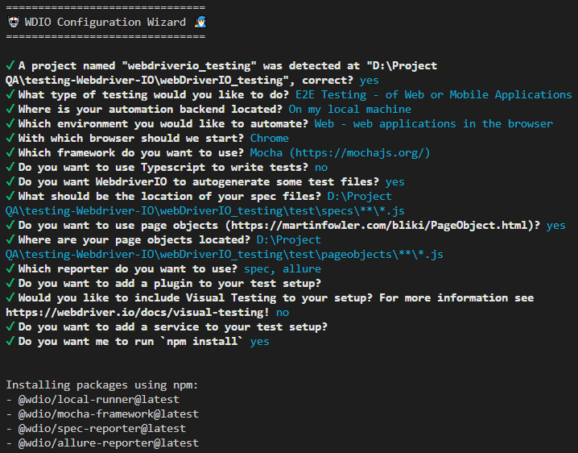

# webDriverIO_testing

Project setup dan WebDriver IO Installation
1. Create new project and open in code editor (Visual Studio Code)
   
2. Open terminal and run command: npm init -y
   
3. Run: npm init wdio
    -> This will create a new file called wdio.conf.js
    -> Run: npm ls wdio to check wdio version
    -> Plugin tambahan:
      a. wait-for: plugin untuk menunggu elemen atau kondisi tertentu muncul sebelum melanjutkan tes.
      b. angular-component-harnesses: plugin untuk menguji komponen Angular.
      c. Testing Library: plugin berdasarkan dom-testing-library
    -> Various services tambahan:
      a. visual: digunakan untuk pengujian visual
      b. Vite dan Nuxt: membantu dalam pengembangan aplikasi modern
      c. firefox-profile: mengelola profil browser
      d. gmail: ntuk pengujian email
      e. sauce dan testingBot: untuk pengujian di browser yang berbeda-beda
    -> WDIO Configuration: konfigurasi dasar untuk pengujian (dapat memilih opsi berbeda sesuai kebutuhan)
   
    -> Run: npm.cmd pkg set scripts.wdio="wdio run ./wdio.conf.js" jika muncul peringatan 
    "Couldn't add script to package.json: "spawn EINVAL", you can add it manually"

4. To run the test:
   a. npm run wdio : menjalankan test secara otomatis dari file package.json dalam script
   b. npx wdio run .\wdio.conf.js : menjalankan test dari  file konfigurasi wdio.conf.js
   c. npm run wdio -- --spec ./test/file.spec.js : menjalankan test spesifik

5. WDIO Reporter with Allure
    -> Jika Allure sudah ditambahkan saat konfigurasi WDIO, maka Allure sudah termasuk di wdio.conf.js pada bagian reporters dan akan membuat folder allure-results saat menjalankan test (file dalam json dan txt).
    -> Jika tidak memilih reporter Allure saat konfigurasi, run: 'npm install @wdio/allure-reporter --save-dev'
    -> Install secara global agar Allure report dapat diakses di mana saja tanpa harus install di setiap project: 'npm i -g allure-commandline --save-dev' 
    -> Run: 'allure generate ./allure-results/' untuk menghasilkan report yang dikumpulkan Allure dalam .html dalam folder ./allure-report/ yang terbentuk dari command tersebut.
    -> Run: 'allure open' untuk membuka report Allure .html di browser
 

